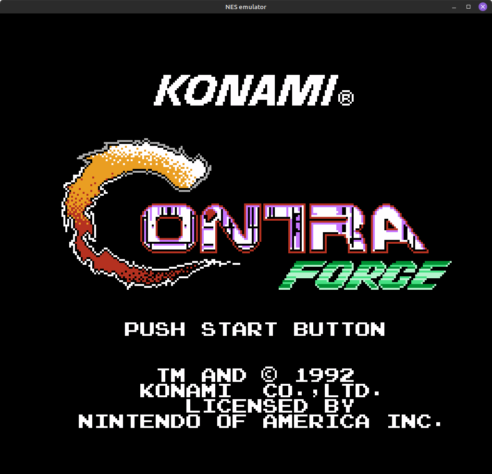
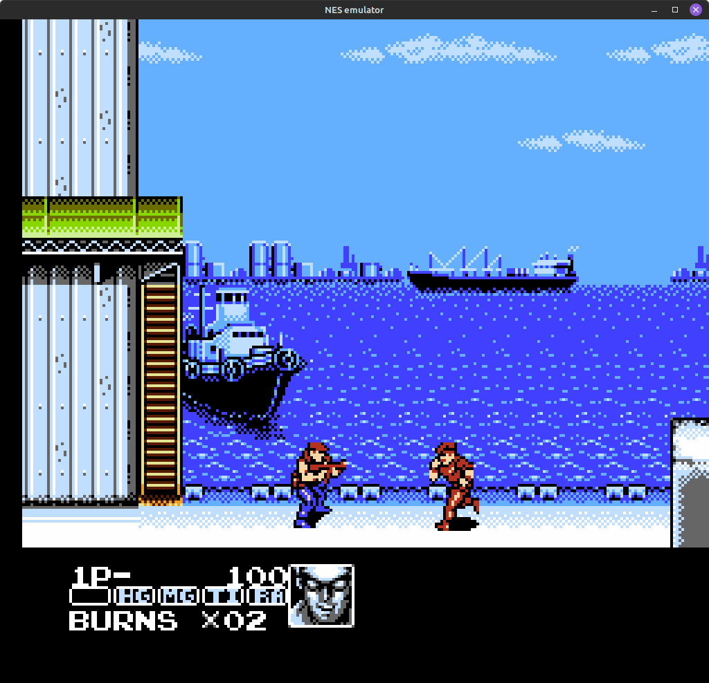
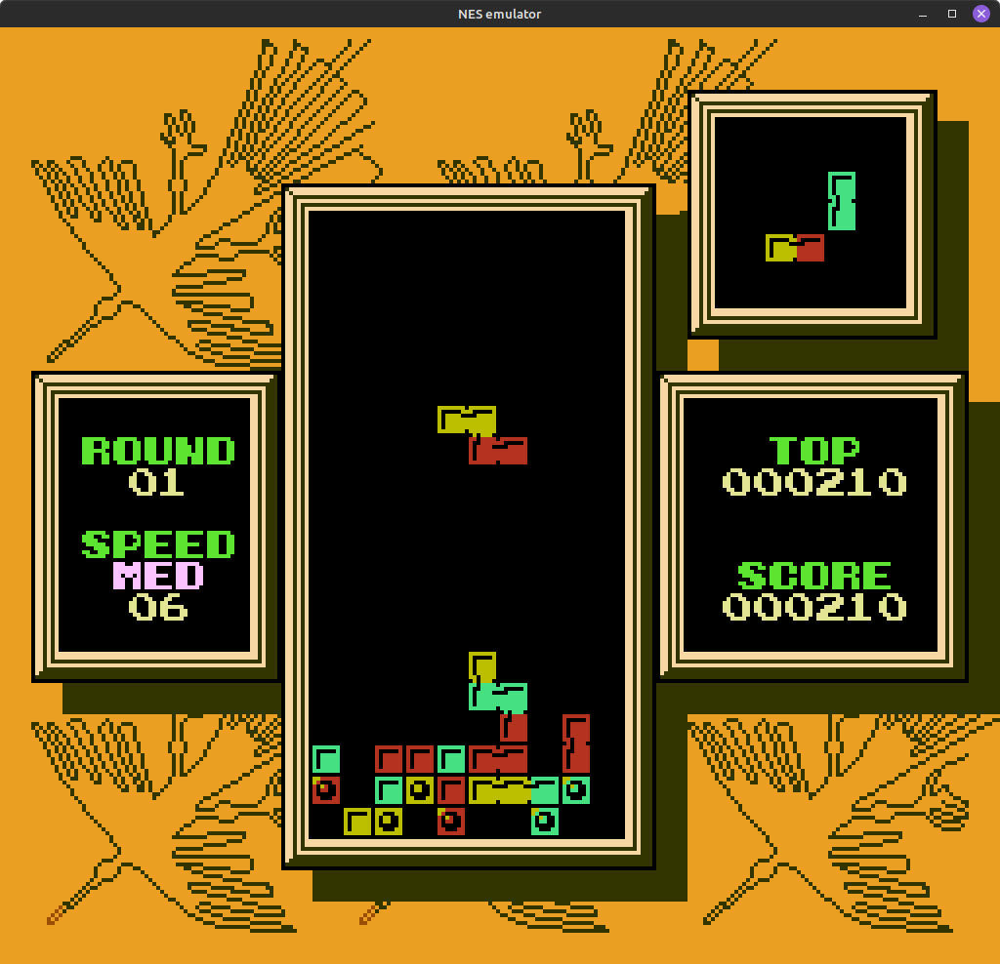

# NES emulator

written in C (with SDL2 for graphics) for fun

## Implemented mappers:
* 000 - NROM
* 001 - MMC1
* 002 - UxROM
* 003 - CNROM
* 004 - MMC3
* 007 - AxROM
* 011 - Color Dreams
* 066 - GxROM

## Supports:
* Official opcodes
* NTSC video (USA and Japan roms)
* 2 seperate controller
* Archaic iNES format
* iNES format
* Custom debug view

## Not supported/implemented:
* Unofficial opcodes
* PAL, Dendy video
* Turbo keys on the controllers
* NES 2.0 format
* APU (so no audio)
* Battery backed RAM (so no saves)
* other mappers

## Other limitations:
* The emulator is only mostly cycle accurate
* GUI is very limited and to switch keys you have to edit the source
* definitely needs more testing

## About debug view:
it displays:
* Zero Page (CPU memmory at 0x0000 - 0x00FF) - green
* CPU registers - purple
* Disassembly of the code - red with blue (blue is at the program counter, so what is being executed)
* PPU palette
* PPU pattern table with the selected palette
* The selected nametable (PPU memmory at 0x2000 - 0x23FF or 0x2400 - 0x27FF or 0x2800 - 0x2BFF or 0x2C00 - 0x2FFF) - yellow


## Favorite screenshots:


## Build instructions for Linux
### Option 1 build locally:
* install required packages:
```shell
sudo apt install git
```

```shell
sudo apt install cmake
```

```shell
sudo apt install libsdl2-dev
```

```shell
sudo apt install libsdl2-image-dev
```

* clone repo:
```shell
git clone --recurse-submodules https://github.com/monkeysoop/NES
```

```shell
cd NES
```

* running setup.sh creates /build and generates all the required Makefiles and copies font.png and /tests directory to where the executable will be  
```shell
chmod +x setup.sh
```

```shell
./setup.sh
```

* running run.sh builds the project and runs it, pass the path to the .nes rom file to it (Note: the executable will be in /build so you should either put the .nes rom in there or put it in /tests and rerun setup.sh)
```shell
chmod +x run.sh
```

```shell
./run.sh tests/nestest.nes
```
nestest.nes is a simple program that is included in the repo (which tests the cpu intructions)

### Option 2 build and run in docker:
* install required packages:
```shell
sudo apt install git
```

```shell
sudo apt install docker.io
```

* start the docker daemon
```shell
sudo systemctl start docker
```

```shell
sudo systemctl enable docker
```
(this is for debian based systems)

* restart the computer

* clone repo:
```shell
git clone --recurse-submodules https://github.com/monkeysoop/NES
```

```shell
cd NES
```

* optional: copy any additional (that you have/downloaded from other places) roms (.nes files) into tests directory, only a test rom (nestest.nes) is included due to copyright/legal reasons

* build the docker image
```shell
docker build -t nes_docker_image .
```

* optional: add more roms (.nes files) to the already built image
```shell
docker create --name nes_docker_image_tmp nes_docker_image
```

```shell
docker cp $(pwd)/tests/Tetris.nes nes_docker_image_tmp:/usr/src/app/build/tests
```
or copy a whole directory
```shell
docker cp $(pwd)/tests/. nes_docker_image_tmp:/usr/src/app/build/tests
```
note: $(pwd) is because docker cp uses absolute paths, but this works fine too:
```shell
docker cp /home/myusername/Downloads/folderwithnesroms/. nes_docker_image_tmp:/usr/src/app/build/tests
```
apply the changes
```shell
docker commit nes_docker_image_tmp nes_docker_image
```

* optional: change the default password for vnc ("mypassword" is the default) in entrypoint.sh
```shell
echo "mypassword" | vncpasswd -f > ~/.vnc/passwd
```

* run the docker image
```shell
docker run --rm -it -p 5901:5901 -p 6080:6080 --name nes_docker_container nes_docker_image build/tests/nestest.nes
```
* optional: if you add -d flagg than it will be run in background
and to kill it if its running in background:
```shell
docker kill nes_docker_container
```
or:
```shell
docker ps
```
and kill it by container id eg:
```shell
docker kill a9c8f9866032
```

* finally open a browser (I only tested firefox and chrome) and go to: http://localhost:6080/vnc.html

## Default keybindings (to change it the only option is to edit the source code)

### Basics:
Esc, q - closes the application
Space - starts/pauses the emulator
r - resets the emulator
i - shows/hides the Debug View window
p - cycles the palette colors on the pattern table in Debug View window
n - cycles the displayed nametables in Debug View window

### Controller 1:
w - Up
a - Left
s - Down
d - Right
g - A
f - B
c - Select
v - Start

## Controller 2:
Up arrow - Up
Left arrow - Left
Down arrow - Down
Right arrow - Right
6 - A
5 - B
1 - Select
2 - Start

## "Some" of the games that I ran succesfully:
* Castlevania


* Castlevania2SimonsQuest


* Contra


* ContraForce


* DonkeyKong


* DonkeyKong3


* DuckHunt


* DuckTales


* DuckTales2


* Jaws


* JurassicPark


* MadMax


* MarioBros


* MarioIsMissing


* MariosTimeMachine


* MegaMan


* MegaMan2


* MegaMan3


* MegaMan4


* MegaMan5


* MegaMan6


* MetalFighter


* Metroid


* PacMan


* PinBall


* Robocop


* Robocop2


* Robocop3


* SuperMarioBros


* SuperMarioBros2


* SuperMarioBros3


* SuperMarioBrosDuckHunt


* Tetris


* Tetris2


* TheLegendOfZelda


* ThunderAndLightning


* WariosWoods


* WreckingCrew


* Zelda2TheAdventureOfLink


